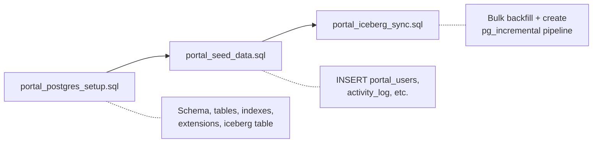

# Plan: Three-Script Iceberg Sync Refactoring

## Context

The current setup has an ordering bug: `portal_postgres_setup.sql` creates the pg_incremental pipeline with `start_time := (SELECT min(event_time) FROM portal_activity_log)`, but the table is empty at that point. A separate `postal_setup_icebergsync.sql` was created as a workaround but uses `start_time := now()`, which skips all historical data.

The user wants:
- Three clearly separated scripts with distinct responsibilities
- The ability to **demonstrate** the live sync to iceberg (1-minute lag is fine)
- The iceberg table will be referenced from Snowflake as a catalog-linked iceberg table

### How pg_incremental works

`pg_incremental` processes data in time windows. When you create a pipeline with `start_time` in the past, it immediately begins catching up in 1-minute chunks (controlled by `time_interval`). The `$1` and `$2` in the command are automatically substituted with the window boundaries (start, end) for each chunk. For 60 days of historical data at 1-minute intervals, that's ~86,400 pipeline executions to catch up — which could take a while but demonstrates the sync mechanism perfectly.

## Proposed Three-Script Architecture



### Script 1: `portal_postgres_setup.sql` (unchanged except remove pipeline)
- Creates all 5 tables + indexes
- Creates extensions (pg_lake, pg_cron, pg_incremental)
- Creates `portal_activity_log_iceberg` USING iceberg
- **Removes** the `incremental.create_time_interval_pipeline(...)` call
- **Removes** the verification queries (those move to script 3)

### Script 2: `portal_seed_data.sql` (unchanged)
- All INSERT statements for portal_users, meter_readings, tariff_orders, service_requests, portal_activity_log
- No changes needed here

### Script 3: `portal_iceberg_sync.sql` (NEW — replaces `postal_setup_icebergsync.sql`)
- Bulk-copies all existing `portal_activity_log` rows into `portal_activity_log_iceberg`
- Creates the pg_incremental pipeline with `start_time := now()` for ongoing sync
- Includes verification queries showing heap vs iceberg row counts match
- Includes the live demo helper (commented out INSERT for simulating new portal activity)

This approach means:
- After running script 3, the iceberg table **immediately** has all data (bulk copy)
- The pipeline handles only **new** data from `now()` onward
- During a demo, you INSERT into `portal_activity_log`, wait 1 minute, and the new rows appear in iceberg (and then in Snowflake via auto-refresh)

## Implementation Steps

### Step 1: Modify `portal_postgres_setup.sql`

Remove Section 4 (lines 114-134, the pipeline creation) and Section 5 (lines 136-149, verification). Add a comment:

```sql
-- ---------------------------------------------------------------------------
-- Section 4: Iceberg Sync Pipeline
-- ---------------------------------------------------------------------------
-- The sync pipeline is configured in a separate script (portal_iceberg_sync.sql)
-- which must be run AFTER loading seed data (portal_seed_data.sql).
-- ---------------------------------------------------------------------------
```

### Step 2: Create `portal_iceberg_sync.sql`

```sql
-- =============================================================================
-- EPOWER Module 2: Portal Iceberg Sync Setup
-- =============================================================================
-- Run this AFTER portal_postgres_setup.sql and portal_seed_data.sql:
--
--   psql service=my_epower_portal -f portal_iceberg_sync.sql
--
-- This script:
--   1. Bulk-copies existing portal_activity_log data into the Iceberg table
--   2. Creates a pg_incremental pipeline for ongoing 1-minute sync
--   3. Verifies row counts match
-- =============================================================================

-- ---------------------------------------------------------------------------
-- Section 1: Initial Backfill (bulk copy historical data to Iceberg)
-- ---------------------------------------------------------------------------

INSERT INTO portal_activity_log_iceberg
SELECT activity_id, customer_key, event_time, event_type,
       event_detail, city, region, customer_type
FROM portal_activity_log;

-- ---------------------------------------------------------------------------
-- Section 2: Create Incremental Pipeline (for new data going forward)
-- ---------------------------------------------------------------------------
-- pg_incremental will automatically substitute $1 and $2 with the time window
-- boundaries for each 1-minute chunk. Since we bulk-copied all existing data
-- above, we start the pipeline from now() to avoid duplicates.

SELECT incremental.create_time_interval_pipeline(
    pipeline_name      := 'sync_portal_activity_to_iceberg',
    time_interval      := '1 minute',
    source_table_name  := 'portal_activity_log',
    start_time         := now(),
    command            := $inner$
        INSERT INTO portal_activity_log_iceberg
        SELECT activity_id, customer_key, event_time, event_type,
               event_detail, city, region, customer_type
        FROM portal_activity_log
        WHERE event_time >= $1 AND event_time < $2
    $inner$
);

-- ---------------------------------------------------------------------------
-- Section 3: Verification
-- ---------------------------------------------------------------------------

SELECT 'portal_users' AS table_name, count(*) AS rows FROM portal_users
UNION ALL SELECT 'meter_readings', count(*) FROM meter_readings
UNION ALL SELECT 'tariff_orders', count(*) FROM tariff_orders
UNION ALL SELECT 'service_requests', count(*) FROM service_requests
UNION ALL SELECT 'portal_activity_log', count(*) FROM portal_activity_log
ORDER BY table_name;

SELECT
    (SELECT count(*) FROM portal_activity_log) AS heap_rows,
    (SELECT count(*) FROM portal_activity_log_iceberg) AS iceberg_rows;

-- ---------------------------------------------------------------------------
-- Section 4: Live Demo Helper
-- ---------------------------------------------------------------------------
-- Run this during a demo to simulate 50 customers using the portal RIGHT NOW.
-- After running, wait ~60 seconds for pg_incremental to sync to Iceberg,
-- then verify in Snowflake.

-- INSERT INTO portal_activity_log (customer_key, event_time, event_type, event_detail, city, region, customer_type)
-- SELECT
--     customer_key,
--     now(),
--     (ARRAY['LOGIN', 'METER_READING', 'TARIFF_CHANGE', 'SERVICE_REQUEST'])[1 + (random() * 3)::int],
--     '{"source": "live_demo"}',
--     'Hamburg',
--     'Nord',
--     'Privatkunde'
-- FROM portal_users
-- ORDER BY random()
-- LIMIT 50;
```

### Step 3: Delete `postal_setup_icebergsync.sql`

This file is superseded by `portal_iceberg_sync.sql`.

### Step 4: Update notebook markdown (Section 4)

Update the instructions in `hol-module2.ipynb` to reflect three scripts:

```markdown
### Step 1: Create the schema + pg_lake setup

```bash
psql service=my_epower_portal -f portal_postgres_setup.sql
```

This creates:
- 5 tables: `portal_users`, `meter_readings`, `tariff_orders`, `service_requests`, `portal_activity_log`
- Indexes for common query patterns
- pg_lake + pg_cron + pg_incremental extensions
- `portal_activity_log_iceberg` (Iceberg mirror table)

### Step 2: Load seed data

```bash
psql service=my_epower_portal -f portal_seed_data.sql
```

### Step 3: Configure and start Iceberg sync

```bash
psql service=my_epower_portal -f portal_iceberg_sync.sql
```

This bulk-copies all existing activity data to the Iceberg table and creates
a pg_incremental pipeline that syncs new data every 1 minute. Verify immediately
that heap and iceberg row counts match.
```

Also update the "Pause" markdown cell to reference all three scripts.

## Verification

After running all three scripts in order:
1. `SELECT count(*) FROM portal_activity_log` should equal `SELECT count(*) FROM portal_activity_log_iceberg`
2. Insert a test row, wait 60 seconds, re-query iceberg — count should increase by 1
3. In Snowflake, after catalog integration + auto-refresh (~30s), query `EPOWER_DEMO.EPOWER_BRONZE.PORTAL_ACTIVITY_LOG` — should show matching data

## Critical Files

- [portal_postgres_setup.sql](hol-module2/portal_postgres_setup.sql) - Remove pipeline creation section
- [portal_iceberg_sync.sql](hol-module2/portal_iceberg_sync.sql) - New file: bulk backfill + pipeline
- [postal_setup_icebergsync.sql](hol-module2/postal_setup_icebergsync.sql) - Delete this file
- [hol-module2.ipynb](hol-module2/hol-module2.ipynb) - Update Section 4 markdown instructions
