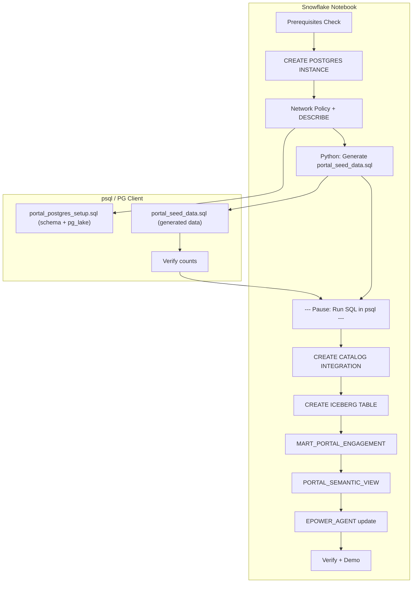

# Plan: Restructure Module 2 — Portal Only, Snowflake + psql Split

## Context

The current notebook has two issues:
1. **psycopg2 cells** add unnecessary complexity — Postgres SQL should be run in a standard PG client
2. **VPP Dispatch section** (cells 36–73) should be removed — portal is the only Postgres use case

The notebook currently has 74 cells. After restructuring:
- Cells 0–35 (portal section) get rewritten to separate Snowflake SQL from Postgres SQL
- Cells 36–73 (VPP dispatch section) get deleted entirely
- A new standalone `portal_postgres_setup.sql` file is created
- A Python cell generates `portal_seed_data.sql` from Snowflake data

## Notebook Flow After Restructure



## Files

### 1. CREATE: [hol/portal_postgres_setup.sql](hol/portal_postgres_setup.sql)

Static Postgres SQL file — schema DDL, pg_lake extensions, Iceberg table, pg_incremental pipeline, verification queries, and live demo helper. Runnable via `psql -f`.

Contents:
```
-- Section 1: Schema (5 tables + indexes)
-- Section 2: pg_lake + pg_cron + pg_incremental extensions
-- Section 3: Iceberg mirror table (USING iceberg)
-- Section 4: pg_incremental pipeline (1-minute sync)
-- Section 5: Verification queries
-- Section 6: Live demo helper INSERT
```

### 2. GENERATED at runtime: `hol/portal_seed_data.sql`

A Python notebook cell reads CUSTOMER_DIM and PRODUCT_DIM from Snowflake and writes INSERT statements for:
- `portal_users` (20K rows, tied to real customer_keys)
- `meter_readings`, `tariff_orders`, `service_requests` (linked to those users)
- `portal_activity_log` (60 days of realistic engagement)

### 3. REWRITE: [hol/hol-module2.ipynb](hol/hol-module2.ipynb)

#### Target cell layout (portal only, ~28 cells)

| # | Type | Section | Content |
|---|------|---------|---------|
| 0 | md | Intro | Module 2 intro (keep existing cell 0, trimmed to portal only) |
| 1 | md | S1 | Prerequisites |
| 2 | code | S1 | Session init |
| 3 | code | S1 | %%sql — USE ROLE/WAREHOUSE/DATABASE + prerequisites check |
| 4 | md | S2 | Create Snowflake Postgres Instance |
| 5 | code | S2 | %%sql — CREATE POSTGRES INSTANCE MY_EPOWER_PORTAL |
| 6 | code | S2 | %%sql — Network policy + DESCRIBE |
| 7 | md | S3 | **psql Setup Guide** — brew install, pg_service.conf, pgpass, connection examples |
| 8 | md | S4 | Portal Schema + pg_lake (Postgres Client) — explains what portal_postgres_setup.sql does, shows how to run it |
| 9 | code | S4 | Python: generate portal_seed_data.sql from Snowflake data |
| 10 | md | S4 | Instructions to run seed file via psql + verification queries |
| 11 | md | S5 | Snowflake Catalog Integration |
| 12 | code | S5 | %%sql — CREATE CATALOG INTEGRATION |
| 13 | code | S5 | %%sql — CREATE ICEBERG TABLE + AUTO_REFRESH |
| 14 | code | S5 | %%sql — Verify (SELECT from Iceberg) |
| 15 | md | S6 | Analytics Model |
| 16 | code | S6 | %%sql — CREATE TABLE MART_PORTAL_ENGAGEMENT |
| 17 | code | S6 | %%sql — Verify mart |
| 18 | md | S7 | Semantic View + Agent Update |
| 19 | code | S7 | %%sql — CREATE SEMANTIC VIEW |
| 20 | code | S7 | %%sql — CREATE AGENT (portal_analyst tool added) |
| 21 | md | S8 | Verification + Demo |
| 22 | md | S8 | Demo questions table |
| 23 | md | S8 | Live Demo: Real-Time Sync — instructions to INSERT in PG client |
| 24 | code | S8 | %%sql — Verify real-time data arrival |
| 25 | md | | Summary |

#### Key changes vs current notebook:
- **Remove** cell 3 (psycopg2 helpers) — no longer needed
- **Remove** cell 8 (pg_connect portal) — no longer needed
- **Replace** cells 10, 13, 15, 16 (Python PG schema/seed/bulk-insert/verify) with markdown guide + one Python .sql generator
- **Replace** cells 18, 19, 20 (Python pg_lake/pipeline/verify) with markdown guide referencing .sql file
- **Replace** cell 33 (Python live demo INSERT) with markdown instructions
- **Keep** cells 22–30 (Snowflake %%sql cells) — catalog integration, Iceberg, analytics, semantic view, agent
- **Delete** cells 35–73 (entire VPP dispatch section)
- **Keep** cell 34 (verify real-time arrival %%sql) and cell 35 (portal summary) — move summary to end

### psql Setup Guide (markdown cell 7) content

Will include:
- **Install psql on macOS**: `brew install libpq && brew link --force libpq`
- **Save connection** using `~/.pg_service.conf`:
  ```ini
  [my_epower_portal]
  host=<host from DESCRIBE output>
  port=5432
  dbname=postgres
  user=snowflake_admin
  sslmode=require
  ```
- **Save password** using `~/.pgpass`:
  ```
  <host>:5432:postgres:snowflake_admin:<password>
  ```
  Then: `chmod 600 ~/.pgpass`
- **Connect**: `psql service=my_epower_portal`
- **Run .sql file**: `psql service=my_epower_portal -f portal_postgres_setup.sql`
- **Alternative** (no service file): `psql "host=<host> port=5432 dbname=postgres user=snowflake_admin sslmode=require"`
- **GUI alternatives**: DBeaver Community (free), pgAdmin 4

## Verification

1. Snowflake SQL cells: validate with `only_compile=true` for CREATE POSTGRES INSTANCE, CATALOG INTEGRATION, ICEBERG TABLE, SEMANTIC VIEW, AGENT
2. portal_postgres_setup.sql: review PG syntax manually (standard PG DDL, well-tested in current notebook)
3. Notebook structure: verify markdown flow reads coherently end-to-end

## Critical Files

- [hol/hol-module2.ipynb](hol/hol-module2.ipynb) — Complete notebook rewrite (portal only, Snowflake SQL + .sql generator)
- [hol/portal_postgres_setup.sql](hol/portal_postgres_setup.sql) — New file: static Postgres DDL + pg_lake setup
- [.snowflake/cortex/plans/restructure-module2-sql-files.plan.md](.snowflake/cortex/plans/restructure-module2-sql-files.plan.md) — Previous plan (superseded)
