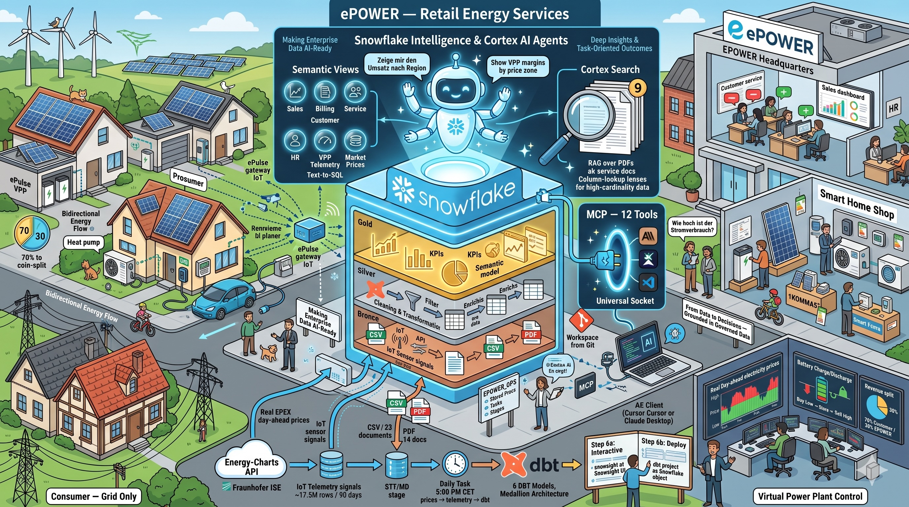
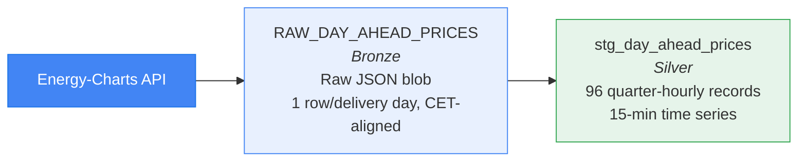
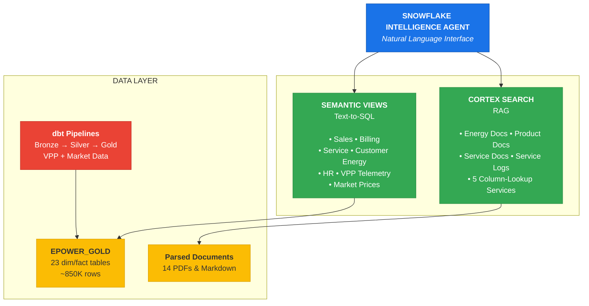
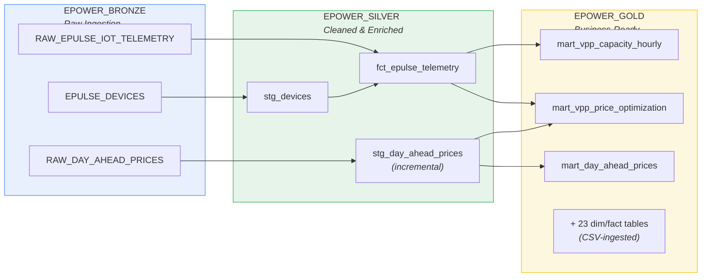
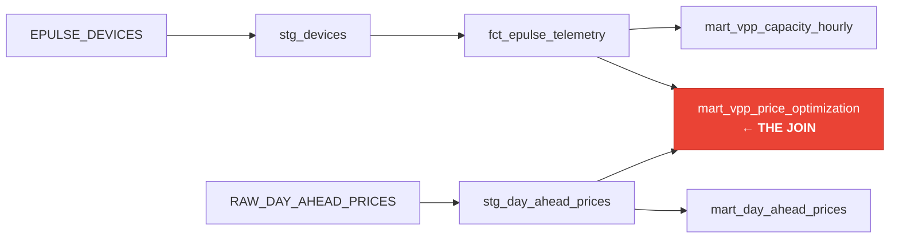

# EPOWER Energy Intelligence Demo



**A hands-on lab for building an Agentic AI application grounded in enterprise data — powered by Snowflake.**

This demo comes with a notebook (`hol/epower_hol.ipynb`) that walks you through building an end-to-end Agentic AI application on Snowflake. The notebook creates all database objects, loads data, deploys the dbt project, and configures the Intelligence Agent. By completing the lab, you gain practical experience with:

- **Snowflake Data Engineering** — dbt projects deployed natively in Snowflake, medallion architecture (Bronze → Silver → Gold), scheduled tasks, and real-time API ingestion
- **Snowflake AI for Agentic Applications** — making enterprise data AI-ready and leveraging Cortex Agent, Semantic Views (text-to-SQL), and Cortex Search (RAG) to build an intelligent agent that is grounded in governed enterprise data

The result: a fully functional **EPOWER Intelligence Agent** that delivers deep insights and task-oriented outcomes — from natural language questions to precise, data-grounded answers across sales, billing, service, HR, and real-time VPP analytics.

> **New to the demo?** Start with `demo_flow.md` for a guided walkthrough with ready-to-use questions.

---

## Installation Instructions

### Step 0: Fork the Repository (Optional)

If you plan to customize the demo or contribute changes, fork the repository first:

1. Navigate to the GitHub repository
2. Click **Fork** to create a copy under your own GitHub account
3. Use your forked repository URL in the steps below instead of the original

This allows you to modify notebooks, dbt models, and demo data while keeping the ability to pull upstream updates.

### Step 1: Create GitHub API Integration (ACCOUNTADMIN)

Snowflake Workspaces connect to Git repositories via an **API integration**. This is a one-time setup per account — if your account already has a GitHub API integration, skip this step.

```sql
USE ROLE ACCOUNTADMIN;

CREATE OR REPLACE API INTEGRATION github_api_integration
    API_PROVIDER = git_https_api
    API_ALLOWED_PREFIXES = ('https://github.com/')
    ENABLED = TRUE;

GRANT USAGE ON INTEGRATION github_api_integration TO ROLE SYSADMIN;
```

> **Note:** `API_ALLOWED_PREFIXES` controls which Git URLs are permitted. The value `'https://github.com/'` allows any GitHub repository. For tighter security, restrict it to your specific org: `'https://github.com/your-org/'`.

To verify an existing integration:
```sql
SHOW API INTEGRATIONS;
DESCRIBE INTEGRATION github_api_integration;
```

### Step 2: Create Snowflake Workspace

1. Navigate to **Projects » Workspaces** in Snowsight
2. Click **+ Workspace** → **Create Workspace from Git Repository**
3. Enter repository URL: `https://github.com/jojrg/Snowflake_EPower_DEMO.git` (or your fork's URL)
4. Select API integration: `github_api_integration`
5. Click **Create**

The workspace clones the repository into Snowflake, making all files (notebooks, dbt project, demo data) available directly in Snowsight.

### Step 3: Run Setup Notebook

1. Open `hol/epower_hol.ipynb` in the Workspace
2. Select a warehouse (any size works; the notebook creates its own `EPOWER_COMPUTE` warehouse)
3. **Run All** cells (~15 minutes)

The notebook creates all database objects, loads data, deploys the dbt project, and configures the Intelligence Agent.

### Step 4: Run the Demo

Use `demo_flow.md` as your guided demo script (12 questions, 4 acts).

### Removing the Demo

To completely remove all demo objects from your account, run the cleanup script:

```sql
-- Run cleanup_reset/epower_cleanup.sql
-- This will:
--   1. Remove the agent from Snowflake Intelligence
--   2. Drop all integrations, the database, warehouse, and role
```

See [`cleanup_reset/epower_cleanup.sql`](cleanup_reset/epower_cleanup.sql) for the full teardown script.

---

## EPOWER Business Domain and Business Model

### The Company

**EPOWER Energy** is a fictional German energy provider serving 20,000 residential and business customers across Germany. Headquartered in Hamburg, the company employs 1,000 people and manages approximately 80,000 contracts.

EPOWER pursues a **360° Energy Strategy** — going beyond traditional electricity and gas supply to offer a full ecosystem of energy products and services:

| Strategy | Description |
|----------|-------------|
| **Supply** | Affordable electricity and gas tariffs |
| **Generate** | Solar installations for self-production |
| **Store** | Battery storage for energy independence |
| **Heat** | Heat pumps replacing fossil heating |
| **Drive** | E-mobility with wallboxes and charging tariffs |
| **Optimize** | Smart home technology for consumption reduction |

### Business Domains

EPOWER operates across **6 business domains**, each represented in the demo with structured data and unstructured documents:

#### 1. Sales & Contracts

Revenue tracking, product sales, and contract management across all energy verticals.

| Data | Description |
|------|-------------|
| **sales_fact** | 80K contract records with revenue, units, dates |
| **product_dim** | 15 products across 6 categories (with CAPEX/OPEX pricing) |
| **customer_dim** | 20K customers (residential & business) |
| **Semantic View** | `ENERGY_SALES_SEMANTIC_VIEW` |

#### 2. Billing & Consumption

Customer energy consumption patterns and billing history.

| Data | Description |
|------|-------------|
| **billing_history** | ~400K billing records with kWh consumption |
| **customer_products** | Product ownership (Solar & Storage, Heat Pump, E-Mobility, Smart Home) |
| **Semantic View** | `BILLING_SEMANTIC_VIEW`, `CUSTOMER_ENERGY_SEMANTIC_VIEW` |

#### 3. Customer Service

Service tickets, complaints, and sentiment analysis.

| Data | Description |
|------|-------------|
| **service_logs** | 10K tickets with topic, sentiment, priority |
| **Documents** | Customer Service Handbook, Invoice FAQ, Energy Tips |
| **Semantic View** | `SERVICE_SEMANTIC_VIEW` |
| **Cortex Search** | `SEARCH_SERVICE_DOCS`, `SEARCH_SERVICE_LOGS` |

#### 4. ePulse Virtual Power Plant (VPP)

IoT telemetry from ~4,050 battery storage systems, orchestrated as a single virtual power plant trading on day-ahead electricity markets.

| Data | Description |
|------|-------------|
| **EPULSE_DEVICES** | Device registry linking customers to IoT gateways |
| **RAW_EPULSE_IOT_TELEMETRY** | Hourly telemetry (~6.5M rows / 60 days): solar yield, battery SOC, grid import/export |
| **RAW_DAY_AHEAD_PRICES** | Day-ahead electricity prices from Energy-Charts API (CET delivery-day aligned) |
| **Documents** | VPP Program Guide, VPP FAQ, Day-Ahead Pricing, Battery Tech Guide |
| **dbt Models** | Medallion architecture (Bronze → Silver → Gold) |

#### 5. HR & Workforce

Employee data, salaries, and attrition tracking.

| Data | Description |
|------|-------------|
| **hr_employee_fact** | 12K records with salary, department, attrition |
| **employee_dim** | Employee profiles |
| **Semantic View** | `HR_SEMANTIC_VIEW` |

#### 6. Finance & Marketing

Financial transactions and marketing campaign performance.

| Data | Description |
|------|-------------|
| **finance_transactions** | 30K transactions with approvals |
| **marketing_campaign_fact** | 16K campaign metrics (spend, leads, impressions) |

### What Is a Virtual Power Plant (VPP)?

A **Virtual Power Plant** aggregates thousands of small, distributed energy resources — residential solar panels, home batteries, heat pumps, EV chargers — and orchestrates them as if they were a single large power plant. Instead of building a gas turbine, EPOWER coordinates ~4,050 home battery systems to absorb cheap electricity and release it when prices spike.

In the real world, companies like [1KOMMA5° (Heartbeat AI)](https://1komma5grad.com/), [Sonnen](https://sonnen.de/), and [Next Kraftwerke](https://www.next-kraftwerke.com/) operate VPPs that trade on European electricity markets. EPOWER's ePulse VPP follows the same model: a cloud-connected gateway in each home reads day-ahead prices and steers the battery accordingly.

**Why it matters for EPOWER:**
- **Revenue stream** — 30% of every arbitrage margin (buy low, sell high) flows to EPOWER
- **Customer value** — 70% goes to the customer as bill savings (€50–150/year)
- **Grid stability** — distributed batteries smooth demand peaks and absorb renewable oversupply
- **Competitive moat** — VPP enrollment increases customer stickiness across all product categories

#### Price-Reactive Telemetry Generation

All VPP telemetry is generated using **real EPEX day-ahead prices** — no heuristics, no approximations. The notebook loads prices first (Section 4), then generates 60 days of telemetry (Section 5) where every battery charge/discharge decision is driven by actual market signals:

| Step | What | How |
|------|------|-----|
| **1. Backfill prices** | 60 days of real EPEX prices | `CALL BACKFILL_DAY_AHEAD_PRICES()` (Section 4) |
| **2. Generate telemetry** | 60 days of price-reactive IoT data | `CALL GENERATE_DAILY_TELEMETRY()` (Section 5) |
| **3. Daily refresh** | Next-day prices + new telemetry | `TASK_DAILY_DATA_REFRESH` (Section 7) |

#### Day-Ahead Price Ingestion

Every day, a scheduled Snowflake Task fetches the next day's electricity market prices from the [Energy-Charts API](https://api.energy-charts.info/) (Fraunhofer ISE). During initial setup, the notebook backfills 60 days of historical prices in a single API call. The daily pipeline then keeps prices current automatically:



| Component | Description |
|-----------|-------------|
| **Stored Procedure** | `CALL FETCH_DAY_AHEAD_PRICES(TARGET_DATE)` — fetch a specific day's prices |
| **Stored Procedure** | `CALL BACKFILL_DAY_AHEAD_PRICES()` — single API range call for 60 days, CET delivery-day aligned |
| **Stored Procedure** | `CALL GENERATE_DAILY_TELEMETRY()` — backfill VPP telemetry gaps using real prices |
| **Task** | `TASK_DAILY_DATA_REFRESH` — daily at 5:00 PM CET (prices published ~13:00 CET) |
| **Idempotent** | All procedures skip dates that already exist |
| **Pipeline** | Task fetches next-day prices → generates telemetry → dbt transforms all |

**Manual fetch:**
```sql
CALL EPOWER_OPS.FETCH_DAY_AHEAD_PRICES(CURRENT_DATE() + 1);
```

### Customer Types

EPOWER serves two fundamentally different customer segments:

**VPP Customers (Prosumers)** are enrolled in the ePulse Virtual Power Plant program. They own solar panels, battery storage, and an ePulse gateway, actively producing, storing, and trading energy.

**Non-VPP Customers (Traditional Consumers)** receive power through the traditional electricity grid — they are pure consumers with standard electricity contracts (like "Ökostrom 100%" or "EPOWER Flex").

| Aspect | VPP Customers | Non-VPP Customers |
|--------|---------------|-------------------|
| **Power Source** | Grid + Own Solar Production | Grid Only |
| **Energy Flow** | Bidirectional (import & export) | Unidirectional (import only) |
| **Equipment** | Solar panels, battery, ePulse gateway | Standard smart meter |
| **Role** | Producer & Consumer (Prosumer) | Consumer only |
| **Grid Interaction** | Active (stabilization, flexibility) | Passive (consumption only) |
| **Revenue** | Consumption costs − VPP earnings (€50–150/year) | Consumption costs only |

---

## Architecture & Snowflake Features

The architecture is designed to reflect EPOWER's business domains and make all enterprise data — structured, semi-structured, and unstructured — accessible through a single intelligent agent. Each architectural layer maps directly to a business need:

- **Data Ingestion** brings in data from each business domain: CSV files for core enterprise data (Sales, Billing, Service, HR, Finance), real-time API calls for electricity market prices, and IoT telemetry from the VPP fleet
- **Data Engineering** (dbt pipelines, medallion architecture) transforms raw VPP telemetry and market prices into business-ready analytics — connecting the two streams in `mart_vpp_price_optimization` where per-device telemetry meets hourly electricity prices to calculate arbitrage margins
- **AI-Ready Layer** makes every business domain queryable: Semantic Views provide text-to-SQL access to structured data (one view per domain), while Cortex Search enables RAG over product documentation, service handbooks, and historical tickets
- **Cortex Agent** orchestrates across all domains — routing natural language questions to the right Semantic View or Cortex Search service, combining structured analytics with document retrieval in a single conversational interface

### Architecture Overview



**Data Flow:**
- **Structured data** (CSV) → Tables → Semantic Views → Agent (text-to-SQL)
- **IoT telemetry** → EPOWER_BRONZE → dbt → EPOWER_SILVER → dbt → EPOWER_GOLD → Semantic View → Agent
- **Documents** (PDF/MD) → Cortex Search → Agent (RAG)

### Snowflake Platform Features

Each Snowflake feature in the architecture serves a specific role in enabling EPOWER's business domains:

| Feature | Business Domain | Role in Architecture |
|---------|----------------|---------------------|
| **Cortex Agent** | All domains | Orchestrates across Sales, Billing, Service, HR, VPP, and Market data — routing natural language questions to the right tool |
| **Semantic Views** | Sales, Billing, Service, HR, VPP, Market Prices | 7 domain-specific data models that translate business questions into SQL (one per domain) |
| **Cortex Search** | Service, Products, Energy | 9 services — 4 document RAG services for policy/handbook retrieval + 5 high-cardinality column lookup services for Semantic View filter values |
| **dbt on Snowflake** | VPP, Market Prices | Native dbt execution (6 models, medallion architecture) transforming raw IoT telemetry and market prices into business-ready analytics |
| **External Access** | VPP, Market Prices | API integration fetching real EPEX day-ahead electricity prices from the Energy-Charts API — the market signal driving VPP battery optimization |
| **Stored Procedures** | VPP, Market Prices | Price ingestion (`FETCH_DAY_AHEAD_PRICES`), telemetry generation (`GENERATE_DAILY_TELEMETRY`) — the operational logic behind the VPP data pipeline |
| **Snowflake Tasks** | VPP, Market Prices | Scheduled daily pipeline (5:00 PM CET): fetch next-day prices → generate telemetry → run dbt — keeping VPP analytics current |
| **Git Integration** | All domains | Repository connected directly to Snowflake Workspace — code, data, notebooks, and dbt project in one place |
| **Snowflake Compute** | All domains | `EPOWER_COMPUTE` virtual warehouse (SMALL, auto-suspend 300s) — single compute cluster for all workloads |
| **MCP Server** | All domains | Snowflake-managed MCP server exposing 12 tools (1 agent + 7 analyst + 4 search) via Model Context Protocol for external AI clients |

---

## Data Pipelines (dbt on Snowflake)

The demo uses **dbt on Snowflake** — native dbt execution without any external infrastructure. The dbt project is deployed directly from the Git-connected Snowflake Workspace and executed with `EXECUTE DBT PROJECT`.

### Medallion Architecture

All data follows a three-layer medallion pattern within the `EPOWER_DEMO` database:



### Two Pipelines, One Project — Connected at the Top

The dbt project (`epower_dbt/`) contains two pipelines that converge in the Gold layer. While VPP telemetry and market prices start as independent streams, they join in `mart_vpp_price_optimization` — the model that calculates battery arbitrage margins by combining per-device telemetry with hourly electricity prices:



#### 1. ePulse VPP Pipeline (`epulse_vpp/`)

Transforms IoT telemetry from ~4,500 battery storage devices into VPP capacity analytics.

| Layer | Model | Type | Description |
|-------|-------|------|-------------|
| **Silver** | `stg_devices` | table | Joins `EPULSE_DEVICES` with `customer_dim` — enriches device registry with customer name, city, region |
| **Silver** | `fct_epulse_telemetry` | table | Joins raw telemetry with `stg_devices` — adds customer context to every IoT reading |
| **Gold** | `mart_vpp_capacity_hourly` | table | Hourly aggregation by region — active VPP devices, total/avg solar yield, battery SOC, net grid flow |
| **Gold** | `mart_vpp_price_optimization` | table | Battery arbitrage analysis — joins telemetry with day-ahead prices, calculates margins (70% customer / 30% EPOWER) |

#### Smart Battery Strategy (Price-Reactive VPP)

EPOWER's VPP uses a **price-reactive battery strategy** that correlates battery charge/discharge cycles with real day-ahead electricity prices from the German DE-LU bidding zone. The core idea: buy electricity when it's cheap (or even negatively priced), store it, and sell it back to the grid when prices are high.

| Price Zone | Threshold | Battery Action | Grid Flow | SOC Target |
|-----------|-----------|---------------|-----------|------------|
| **Negative** | < €0/MWh | Max Charge | Import +3.5 to +5 kW | 85–95% |
| **Low** | < P25 (~€88/MWh) | Charge | Import +2 to +4.5 kW | 70–92% |
| **Medium** | P25–P75 | Self-Consume | Small ±1.5 kW | 40–70% |
| **High** | > P75 (~€144/MWh) | Discharge | Export -2 to -5 kW | 12–35% |

**Revenue Model:** The arbitrage margin (buying cheap, selling expensive) is split **70% customer / 30% EPOWER**, following industry-standard VPP aggregator economics. The `mart_vpp_price_optimization` dbt model calculates per-device, per-hour margins including import costs, export revenue, and the customer/EPOWER split.

#### 2. Energy Market Data Pipeline (`energy_market_data/`)

Transforms raw day-ahead electricity prices from the Energy-Charts API into analytics-ready time series.

| Layer | Model | Type | Description |
|-------|-------|------|-------------|
| **Silver** | `stg_day_ahead_prices` | incremental | Flattens VARIANT JSON into rows — one row per 15-min price interval with EUR/MWh |
| **Gold** | `mart_day_ahead_prices` | table | Enriches prices with EUR/kWh conversion, hour-of-day, and day-of-week for pattern analysis |

### dbt Project Structure

```
epower_dbt/
├── dbt_project.yml                 # Project: epower_analytics
├── macros/
│   └── generate_schema_name.sql    # Routes models to exact schema names
└── models/
    ├── sources.yml                 # Shared: epower_bronze + epower_gold sources
    ├── epulse_vpp/
    │   ├── staging/                # → EPOWER_SILVER (tables)
    │   │   ├── stg_devices.sql
    │   │   └── fct_epulse_telemetry.sql
    │   └── marts/                  # → EPOWER_GOLD (tables)
    │       ├── mart_vpp_capacity_hourly.sql
    │       └── mart_vpp_price_optimization.sql
    └── energy_market_data/
        ├── staging/                # → EPOWER_SILVER (incremental)
        │   └── stg_day_ahead_prices.sql
        └── marts/                  # → EPOWER_GOLD (tables)
            └── mart_day_ahead_prices.sql
```

### Deployment & Execution

The dbt project runs natively inside Snowflake — no local dbt CLI, no external CI/CD. The notebook uses a two-step approach for didactic clarity:

**Step 6a — Interactive run in Snowsight UI:** Open the dbt project in the Snowsight Workspace and run/test it interactively. This lets you inspect each model's output and understand the pipeline before automating it.

**Step 6b — Deploy as Snowflake object:** Once validated, deploy the project as a first-class Snowflake object that can be executed programmatically and scheduled:

```sql
CREATE OR REPLACE DBT PROJECT EPOWER_DEMO.EPOWER_OPS.EPOWER_ANALYTICS_PROJECT
    FROM 'snow://workspace/.../epower_dbt';

EXECUTE DBT PROJECT EPOWER_DEMO.EPOWER_OPS.EPOWER_ANALYTICS_PROJECT ARGS = 'run';

EXECUTE DBT PROJECT EPOWER_DEMO.EPOWER_OPS.EPOWER_ANALYTICS_PROJECT ARGS = 'test';
```

A **Snowflake Task** (`TASK_DAILY_DATA_REFRESH`) runs daily at 5:00 PM CET to fetch next-day prices, generate telemetry, and run the full dbt pipeline:

```sql
CALL EPOWER_OPS.FETCH_DAY_AHEAD_PRICES(CURRENT_DATE() + 1);
CALL EPOWER_OPS.GENERATE_DAILY_TELEMETRY();
EXECUTE DBT PROJECT EPOWER_DEMO.EPOWER_OPS.EPOWER_ANALYTICS_PROJECT ARGS = 'run';
```

---

## Demo Script

See **[`demo_flow.md`](demo_flow.md)** for the full guided walkthrough — a 12-question demo script across 4 acts with presenter tips, agent tool annotations, and additional domain questions.

---

## MCP Server (Model Context Protocol)

The demo includes a **Snowflake-managed MCP server** (`EPOWER_MCP_SERVER`) that exposes the EPOWER Intelligence Agent, all Semantic Views, and all Cortex Search Services via the [Model Context Protocol](https://modelcontextprotocol.io/) standard. This allows any MCP-compatible client (Claude Desktop, Cursor, VS Code + Copilot, etc.) to discover and invoke EPOWER tools directly.

### Available Tools

| Tool Name | Type | Description |
|-----------|------|-------------|
| `epower-agent` | `CORTEX_AGENT_RUN` | Full Intelligence Agent — orchestrates across all domains |
| `energy-sales-analyst` | `CORTEX_ANALYST_MESSAGE` | Contracts, products, sales revenue |
| `billing-analyst` | `CORTEX_ANALYST_MESSAGE` | Consumption, billing, payments |
| `service-analyst` | `CORTEX_ANALYST_MESSAGE` | Service tickets, complaints |
| `customer-energy-analyst` | `CORTEX_ANALYST_MESSAGE` | Consumption by product ownership |
| `hr-analyst` | `CORTEX_ANALYST_MESSAGE` | HR workforce data, salaries |
| `market-prices-analyst` | `CORTEX_ANALYST_MESSAGE` | Day-ahead electricity spot prices |
| `vpp-telemetry-analyst` | `CORTEX_ANALYST_MESSAGE` | VPP IoT: solar, battery, grid |
| `energy-docs-search` | `CORTEX_SEARCH_SERVICE_QUERY` | Energy policies, terms |
| `product-docs-search` | `CORTEX_SEARCH_SERVICE_QUERY` | Product documentation |
| `service-docs-search` | `CORTEX_SEARCH_SERVICE_QUERY` | Service handbook |
| `service-logs-search` | `CORTEX_SEARCH_SERVICE_QUERY` | Historical service tickets |

### MCP Endpoint

```
https://<account_url>/api/v2/databases/EPOWER_DEMO/schemas/EPOWER_GOLD/mcp-servers/EPOWER_MCP_SERVER
```

Replace `<account_url>` with your Snowflake account URL (use hyphens instead of underscores in the hostname).

### Connecting MCP Clients

#### Prerequisites

Create an OAuth security integration for MCP authentication:

```sql
USE ROLE ACCOUNTADMIN;

CREATE OR REPLACE SECURITY INTEGRATION epower_mcp_oauth
    TYPE = OAUTH
    OAUTH_CLIENT = CUSTOM
    ENABLED = TRUE
    OAUTH_CLIENT_TYPE = 'CONFIDENTIAL'
    OAUTH_REDIRECT_URI = 'http://localhost:8001/callback';

SELECT SYSTEM$SHOW_OAUTH_CLIENT_SECRETS('EPOWER_MCP_OAUTH');
```

#### Claude Desktop

Add to `~/Library/Application Support/Claude/claude_desktop_config.json` (macOS) or `%APPDATA%\Claude\claude_desktop_config.json` (Windows):

```json
{
  "mcpServers": {
    "epower-mcp": {
      "url": "https://<account_url>/api/v2/databases/EPOWER_DEMO/schemas/EPOWER_GOLD/mcp-servers/EPOWER_MCP_SERVER"
    }
  }
}
```

#### Cursor

Navigate to **Settings → Cursor Settings → MCP** and add:

```json
{
  "mcpServers": {
    "epower-mcp": {
      "url": "https://<account_url>/api/v2/databases/EPOWER_DEMO/schemas/EPOWER_GOLD/mcp-servers/EPOWER_MCP_SERVER"
    }
  }
}
```

#### Snowflake Labs MCP Server (Alternative)

For a locally-run MCP server with additional capabilities (object management, SQL execution), use the [Snowflake Labs MCP Server](https://github.com/Snowflake-Labs/mcp):

```bash
uvx snowflake-labs-mcp --service-config-file config.yaml --connection-name default
```

### Access Control

MCP clients need the following grants to use the tools:

```sql
GRANT USAGE ON MCP SERVER EPOWER_DEMO.EPOWER_GOLD.EPOWER_MCP_SERVER TO ROLE EPOWER_ROLE;
```

---

## Repository Structure

```
Snowflake_EPower_Demo/
│
├── README.md                        # This file — architecture, setup, business context
├── demo_flow.md                     # Guided demo walkthrough (12 questions, 4 acts)
│
├── hol/                             # ── Hands-On Lab ──
│   └── epower_hol.ipynb             # Main setup notebook — run this to build everything
│
├── cleanup_reset/                   # ── Cleanup & Reset ──
│   └── epower_cleanup.sql           # Teardown: drop all demo objects
│
├── demo_data/
│   ├── structured_data/             # 23 CSV files loaded into EPOWER_GOLD
│   │   ├── customer_dim.csv         #   20K customers (residential & business)
│   │   ├── product_dim.csv          #   15 products, 6 categories, CAPEX/OPEX
│   │   ├── sales_fact.csv           #   ~80K contract records
│   │   ├── billing_history.csv      #   ~400K billing records with kWh
│   │   ├── customer_products.csv    #   Product ownership per customer
│   │   ├── service_logs.csv         #   ~10K service tickets
│   │   ├── hr_employee_fact.csv     #   12K HR records
│   │   ├── employee_dim.csv         #   Employee profiles
│   │   ├── finance_transactions.csv #   30K financial transactions
│   │   ├── marketing_campaign_fact.csv  # 16K campaign metrics
│   │   └── ...                      #   + 13 dimension tables (region, channel, etc.)
│   │
│   └── unstructured_data/           # 14 PDF/MD documents for Cortex Search (RAG)
│       ├── energy/                  #   5 docs: Green Power TCs, VPP program, pricing,
│       │                            #           heat pump subsidies, vendor policy
│       ├── products/                #   5 docs: Solar/battery quickstart, smart meter,
│       │                            #           battery tech, e-mobility, heat pump guide
│       └── service/                 #   4 docs: Service handbook, invoice FAQ,
│                                    #           energy tips, VPP FAQ
│
├── epower_dbt/                      # dbt project — deployed natively in Snowflake
│   ├── dbt_project.yml              #   Project config: epower_analytics
│   ├── profiles.yml                 #   Connection profile (Snowflake-native execution)
│   ├── macros/
│   │   └── generate_schema_name.sql #   Routes models to exact schema names (SILVER/GOLD)
│   └── models/
│       ├── sources.yml              #   Shared source definitions (epower_bronze + epower_gold)
│       ├── epulse_vpp/              #   VPP pipeline (telemetry → capacity → arbitrage)
│       │   ├── staging/
│       │   │   ├── stg_devices.sql          # Device registry + customer context
│       │   │   ├── fct_epulse_telemetry.sql # Raw telemetry + device enrichment
│       │   │   └── schema.yml               # Column docs + tests
│       │   └── marts/
│       │       ├── mart_vpp_capacity_hourly.sql      # Fleet aggregation by region/hour
│       │       ├── mart_vpp_price_optimization.sql   # THE JOIN: telemetry × prices → margins
│       │       └── schema.yml                        # Column docs + tests
│       └── energy_market_data/      #   Market data pipeline (prices → analytics)
│           ├── staging/
│           │   ├── stg_day_ahead_prices.sql  # Flatten VARIANT JSON (incremental)
│           │   └── schema.yml                # Column docs + tests
│           └── marts/
│               ├── mart_day_ahead_prices.sql # EUR/kWh, hour_of_day, day_of_week
│               └── schema.yml                # Column docs + tests
│
├── generators/                      # ── Internal dev tools (not needed for the lab) ──
│   ├── generate_data.py             # Regenerate structured CSV data
│   ├── generate_docs.py             # Regenerate unstructured documents
│   └── create_notebook.py           # Helper: creates notebook scaffold
│
└── images/
    └── epower_wimmel.jpg            # Header image for README
```

### Key Assets

| Asset | Purpose | When to Use |
|-------|---------|-------------|
| `hol/epower_hol.ipynb` | Creates all Snowflake objects end-to-end | Initial setup — run once |
| `demo_flow.md` | 12-question guided demo script (4 acts) | During the demo |
| `cleanup_reset/epower_cleanup.sql` | Drops all demo objects | Teardown / reset |
| `epower_dbt/` | dbt project with 6 models (medallion architecture) | Deployed by the notebook; edit models here |
| `demo_data/structured_data/` | 23 CSV files loaded into EPOWER_GOLD | Source data — regenerate with `generators/generate_data.py` |
| `demo_data/unstructured_data/` | 14 PDF/MD documents for RAG search | Source docs — regenerate with `generators/generate_docs.py` |

---

*EPOWER Energy Intelligence Demo — Powered by Snowflake Cortex*
